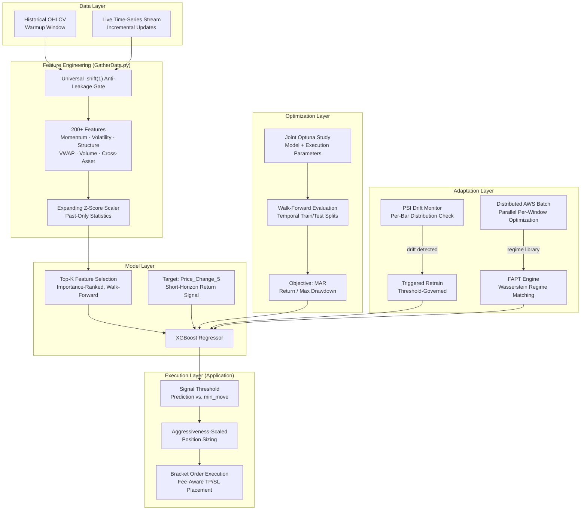
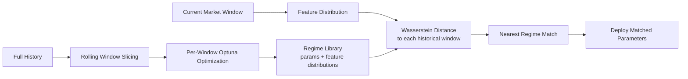
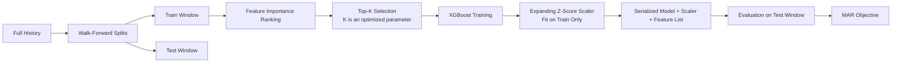

# Regime-Adaptive ML System For Non-Stationary Markets
*An adaptive ML system for non-stationary time-series environments*

A machine learning system designed for **decision-making under non-stationarity**, where both the model and its execution behavior must continuously adapt to shifting data distributions.

Rather than treating optimization as a one-time step, this system treats it as an ongoing process: drift detection, walk-forward retraining, and regime-aware parameter selection work together continuously.

---

## The Central Problem

Most ML systems trained on historical data assume that the distribution at training time resembles the distribution at inference time. In practice, financial time series exhibit:

- Volatility clustering and regime switching
- Structural breaks from macro events
- Correlation instability across assets
- Distribution drift that invalidates static models

This system's thesis: **a model that adapts its parameters based on detected regime similarity will outperform a model with fixed globally-optimized parameters** across a non-stationary environment.

---

## System at a Glance




---

## Core Systems

### 1. Wasserstein Regime Adaptation (FAPT - Feature Aggregation Parameter Tuning)

FAPT rejects the premise that a single globally optimal parameter set exists.

FAPT effectively reframes optimization as a **nearest-neighbor retrieval problem in regime space**, rather than a repeated global search.

**The insight:** Historical market windows are not interchangeable. A parameter set optimized on a high-volatility trending regime will behave differently than one trained on a mean-reverting range-bound period. Rather than averaging across all history, the system should identify *which historical conditions are most similar to now* and retrieve the parameters that performed best under those conditions.

**Pipeline:**




1. **Offline (AWS Batch):** Full history is divided into rolling windows. Each window runs an independent Optuna optimization study. Results are stored as a regime library: `{window → best_params, feature_distribution}`.
2. **At runtime:** The current market window's feature distribution is compared to every historical window using Wasserstein distance. The parameters from the closest historical regime are deployed.

This converts optimization from a global solve into a **conditional, regime-aware retrieval problem**.

**Current status:** Fully implemented. Disabled pending migration of regime library from legacy equities pipeline to crypto data.

---

### 2. Joint Hyperparameter Optimization

Model architecture and execution parameters are not optimized independently. They are co-evolved in a single joint Optuna study.

```
Trials:    6,000 (Optuna TPE sampler, SQLite-backed, resumable)
Objective: MAR = Final Capital / Initial Capital ÷ Max Drawdown Fraction

Model parameters:
  n_estimators, max_depth, learning_rate, subsample,
  colsample_bytree, reg_alpha, reg_lambda, min_child_weight, gamma

Execution parameters:
  min_risk_pct, max_risk_pct, aggressiveness, stop_loss_multiplier,
  take_profit_rr, min_move, atr_weight, feature_count_k, window_fraction
```

The rationale: model expressiveness and signal threshold calibration interact. A high-sensitivity model requires tighter execution filters; a conservative model may benefit from more aggressive sizing. Separating these optimizations introduces a coupling error that joint optimization avoids.

Best result: `MAR=6167, Sharpe=0.855, win_rate=52.3%, max_DD=-14.4%` (2,449 trades, walk-forward evaluation).

---

### 3. PSI-Triggered Adaptive Retraining

Rather than retraining on a fixed schedule, the system monitors **Population Stability Index** on every incoming bar, comparing the live feature distribution to the training-time distribution:

```
PSI = Σ (actual_pct − expected_pct) × ln(actual_pct / expected_pct)
```


| PSI Value | Response                     |
| --------- | ---------------------------- |
| < 0.12    | No action                    |
| 0.12–0.25 | Mild drift flag (logged)     |
| > 0.25    | Immediate in-process retrain |


A 50-bar cooldown prevents retraining cascades. This makes model lifecycle management **event-driven and statistically justified**, rather than time-driven.

---

### 4. Walk-Forward Training with Dynamic Feature Selection




- **Window size** is a tunable fraction of available history (clamped: 300–50,000 bars)
- **Feature count K** is tuned by Optuna. The system learns how many features is optimal, not just which ones.
- **Scaler** is fit on the training window only and persisted alongside the model, ensuring no statistics from the test or live window contaminate scaling

---

### 5. Universal Anti-Leakage Architecture

Lookahead bias is the most common failure mode in backtested ML systems. This system enforces leakage prevention at the architectural level, not as a per-feature convention:

- `**.shift(1)` gate:** Every feature in `GatherData.py` is computed on source data shifted by one bar before any indicator is applied. This is a single enforced transformation, not a checklist.
- **Expanding Z-Score Scaler:** Rolling statistics use only past observations. At inference time, the scaler updates its running mean/std state incrementally, never using future data.
- **Walk-forward boundaries:** Train/test splits are enforced with no overlap. Test windows are never exposed during training or feature selection.

---

### 6. Distributed AWS Batch Optimization

FAPT requires running full Optuna studies across hundreds of rolling historical windows. Local computation is infeasible.

```python
num_instances = 20      # parallel EC2 jobs
window_size   = 2350    # bars per window
step_size     = 310     # stride between windows
queue         = "MLTraderQueue"
```

Each job receives a `(start_index, end_index)` slice and runs its optimization independently. Results are aggregated from S3. This turns a weeks-long sequential computation into a scalable parallel batch pipeline.

---

## Feature Engineering

The system generates ~200 engineered features across categories including momentum, volatility, market structure, volume dynamics, and cross-asset context.

Feature engineering is intentionally broad and redundant. Signal extraction is delegated to the model and the walk-forward feature selection process, rather than manual feature pruning.

All features are computed under strict anti-leakage constraints using a universal .shift(1) transformation and past-only statistics.

---

## Codebase Map

```
TradingStrategy_JointOptimization.py    - Walk-forward backtest + joint Optuna optimization loop
GatherData.py                           - Feature engineering engine (shared: training + inference)
FAPT_Optimization.py                    - Per-window optimization to build regime library
FAPT_Wasserstein.py                     - Wasserstein regime matching, current window to closest history
AWS_Batch_FAPT.py                       - Distributed job dispatch to AWS Batch

binance_data_puller.py                  - Historical data acquisition (Binance)
coinbase_data_puller.py                 - Historical data acquisition (Coinbase)

binance_bot.py                          - Live execution engine (Binance WebSocket)
coinbase_bot.py                         - Live execution engine (Coinbase)

Parameters/
  XRP_USD_Joint_Optimization.json       - Serialized Optuna trial results (top-10 by MAR)
```

**Runtime modes:**

- **Backtest / Optimization** (`TradingStrategy_JointOptimization.py`): walk-forward loop with Optuna, SQLite persistence, `SKIP_OPTIMIZATION` flag to replay specific parameters
- **Live Inference** (broker bot files): WebSocket-driven, stateful incremental updates, in-process PSI monitoring and retraining

Both modes share `GatherData.py`, ensuring training and inference operate on identical feature computation logic.

---

## Engineering Challenges

**Non-stationarity across multiple timescales.** The system must handle regime shifts at three timescales: intraday volatility cycles, multi-week market regime changes, and structural macro-driven breaks. PSI retraining addresses short/medium timescales. FAPT targets longer structural shifts. Neither mechanism alone is sufficient. They are designed as complementary layers.

**Temporal integrity across two runtimes.** The backtest and live system must produce identical feature values for identical input. The `.shift(1)` gate handles training-time leakage, but live inference must incrementally update running statistics without future bar access. The expanding scaler's running state must be correctly initialized from historical warmup data at cold start. This is a non-obvious consistency requirement.

**Joint optimization search space.** Simultaneously tuning 18+ parameters across model architecture and execution creates a high-dimensional, non-convex search space. Parameters like `feature_count_k` and `window_fraction` interact with training time in ways the objective function cannot fully capture. TPE sampler explores this space without prior knowledge of parameter interactions.

**Distributional Wasserstein at scale.** FAPT's current implementation computes distance on per-feature scalar summaries rather than full multivariate distributions. True distributional Wasserstein over high-dimensional feature spaces would be more theoretically grounded but substantially more expensive across thousands of historical windows at inference time.

---

## Known Limitations

- **FAPT regime library is asset-specific.** Infrastructure is complete; regime library requires rebuild for the current data pipeline.
- **Backtest fee assumptions are optimistic.** Backtest uses 0.095% maker/taker; live execution fees differ by tier and order type. This is a known source of performance overestimation.
- **Scalar Wasserstein in FAPT.** Current regime matching computes distance on per-feature scalars (effectively L1), not full multivariate distributions. Regime discrimination accuracy may be reduced.
- **Single-position constraint.** The system enforces at most one open position at a time. Design choice.
- **Cross-asset features not wired to crypto context.** SPY/QQQ/DIA/VXX features are engineered but unused in the current pipeline. No crypto-native equivalent (e.g., BTC dominance, ETH/BTC ratio) has been substituted.

---

## Roadmap

- **FAPT migration.** Rebuild the per-window regime library using current pipeline data and joint optimization objective. Highest-priority architectural item.
- **Multivariate distributional Wasserstein.** Replace scalar-level distance with Wasserstein on PCA-reduced feature embeddings for more accurate regime matching.
- **Fee-corrected backtest configuration.** Introduce live-equivalent fee parameters as a named configuration to produce realistic performance benchmarks.
- **Crypto-native cross-asset context.** Replace equity indices with BTC dominance, ETH/BTC ratio, or crypto volatility indices as cross-asset context features.
- **Calibrated confidence-weighted sizing.** Replace magnitude-proxy aggressiveness scaling with a calibrated probability estimate for more principled position sizing.

---
