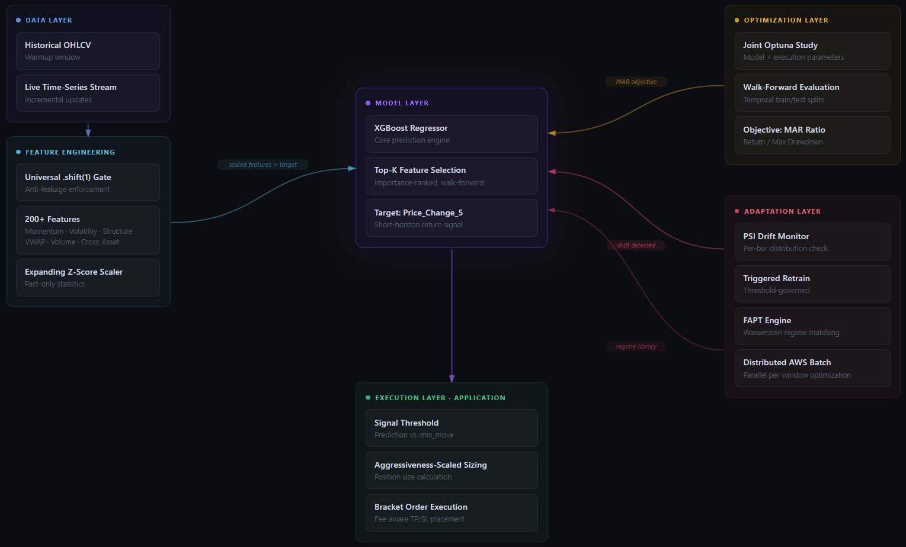
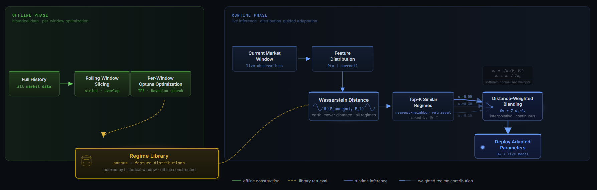
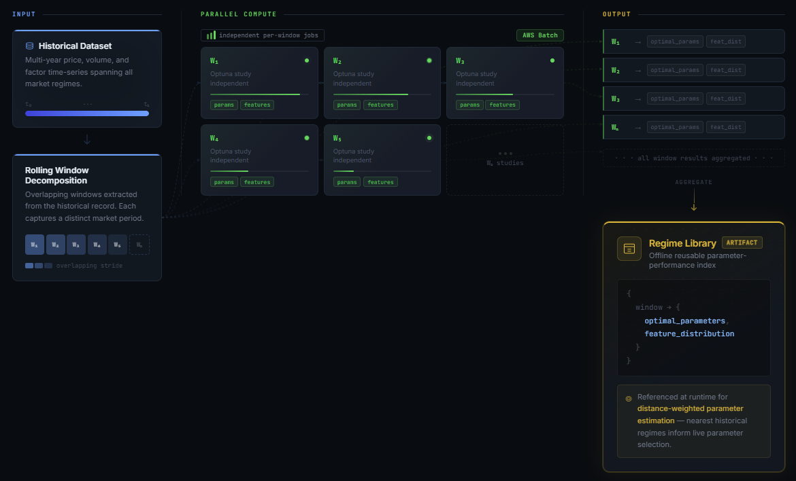
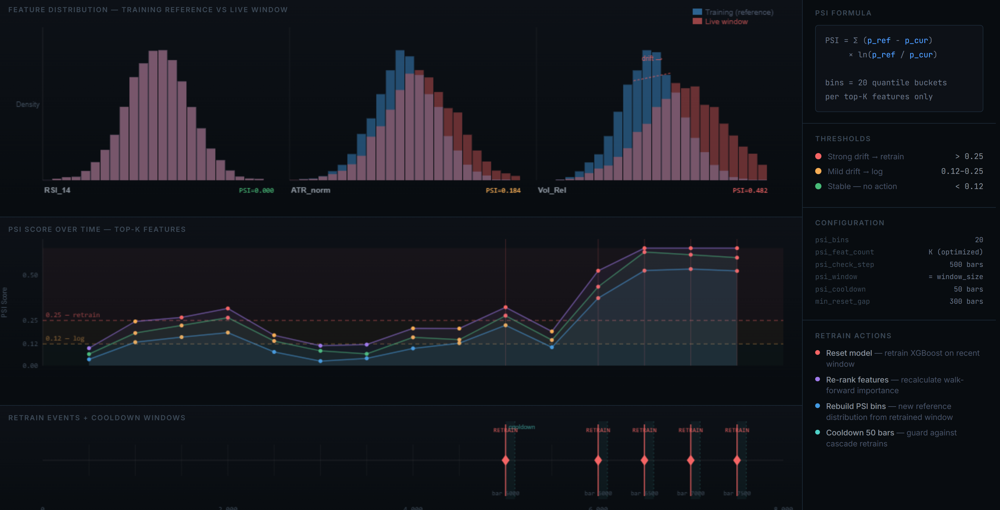
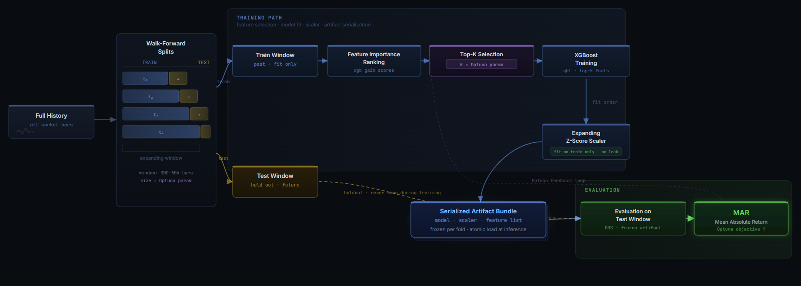

# Regime-Adaptive ML System For Non-Stationary Markets
*An adaptive ML system for non-stationary time-series environments*

A machine learning system designed for **decision-making under non-stationarity**, where both the model and its execution behavior must continuously adapt to shifting data distributions.

Rather than treating optimization as a one-time step, this system treats it as an ongoing process: drift detection, walk-forward retraining, and regime-aware parameter selection work together continuously.

---

## The Central Problem

Most ML systems trained on historical data assume that the distribution at training time resembles the distribution at inference time. In practice, financial time series exhibit:

- Volatility clustering and regime switching
- Structural breaks from macro events
- Correlation instability across assets
- Distribution drift that invalidates static models

This system's thesis: **a model that adapts its parameters based on detected regime similarity will outperform a model with fixed globally-optimized parameters** across a non-stationary environment.

---

## System at a Glance

<p align="center">
  
</p>

---

## Core Systems

### 1. Wasserstein Regime Adaptation (FAPT - Feature Aggregation Parameter Tuning)

FAPT rejects the premise that a single globally optimal parameter set exists.

Rather than treating optimization as a nearest-neighbor lookup, FAPT models parameter selection as a **continuous function over regime space**, using distributional similarity to interpolate between historically optimal configurations.

**The insight:** Historical market windows are not discrete states but points in a continuous space of market conditions. A parameter set optimized for one regime may still be partially valid in a nearby regime. Instead of selecting a single closest match, the system blends information from multiple regimes based on similarity.

---

### Regime Matching and Parameter Interpolation

At runtime:

1. The current market window is represented as a feature distribution
2. Wasserstein distance is computed between the current distribution and all historical windows
3. Multiple nearby regimes are considered, not just the closest one
4. Parameters are computed as a **distance-weighted combination** of the top matching regimes

This results in behavior such as:

* if the current regime lies between two historical regimes
* parameters will be interpolated accordingly (e.g., 80% regime A, 20% regime B)

---

### Pipeline

<p align="center">
  
</p>

---

## Regime Space Projection and Distance-Weighted Parameter Interpolation (Wasserstein Distance Approximation)

<p align="center">
  
</p>

*Projection of high-dimensional feature distributions into 3D space for visualization of regime similarity and parameter blending*

- Each point represents a **market state embedded in regime space**, derived from feature distribution statistics.  
- The visualization shows a **3D projection** of this space. The true regime space is **high-dimensional (50D+)**.  
- Regime clusters represent historical windows with **locally optimized parameter configurations**.  
- The current market state is positioned relative to these clusters based on **Wasserstein distance between feature distributions**.  
- Parameter selection is performed via **distance-weighted interpolation across multiple nearby regimes**, not discrete nearest-neighbor selection.  
- The projection is illustrative. Distances and structure reflect similarity relationships but are **compressed from higher-dimensional geometry**.

---

### Offline Phase (AWS Batch)

<p align="center">
  
</p>

* Historical data is divided into rolling windows
* Each window runs an independent optimization study
* Results are stored as:
  `{window → optimal_parameters, feature_distribution}`

This forms a **regime library** of parameter-performance mappings.

---

### Runtime Behavior

Instead of selecting a single regime, the system performs:

* **soft matching** across multiple regimes
* **distance-weighted interpolation** of parameter sets

This converts optimization from:

* a global static solve
  to:
* a **continuous, regime-aware parameter mapping**

---

### Why This Matters

A nearest-neighbor approach introduces discontinuities:

* small changes in market conditions can cause large parameter jumps

FAPT avoids this by:

* producing **smooth transitions between parameter configurations**
* maintaining stability across borderline regimes
* better capturing the continuous nature of market dynamics

---

### Current Status

Fully implemented. Computationally expensive due to per-window optimization. Preliminary experiments indicate performance comparable to the conservative joint optimization baseline under similar evaluation conditions. Further large-scale validation is pending.

---

### 2. Joint Hyperparameter Optimization

Model architecture and execution parameters are not optimized independently. They are co-evolved in a single joint Optuna study.

<p align="center">
  
</p>

```
Trials:    6,000 (Optuna TPE sampler, SQLite-backed, resumable)
Objective: MAR = Final Capital / Initial Capital ÷ Max Drawdown Fraction

Model parameters:
  n_estimators, max_depth, learning_rate, subsample,
  colsample_bytree, reg_alpha, reg_lambda, min_child_weight, gamma

Execution parameters:
  min_risk_pct, max_risk_pct, aggressiveness, stop_loss_multiplier,
  take_profit_rr, min_move, atr_weight, feature_count_k, window_fraction
```

The rationale: model expressiveness and signal threshold calibration interact. A high-sensitivity model requires tighter execution filters; a conservative model may benefit from more aggressive sizing. Separating these optimizations introduces a coupling error that joint optimization avoids.

---

### 3. PSI-Triggered Adaptive Retraining

Rather than retraining on a fixed schedule, the system monitors **Population Stability Index** on every incoming bar, comparing the live feature distribution to the training-time distribution:

```
PSI = Σ (actual_pct − expected_pct) × ln(actual_pct / expected_pct)
```


| PSI Value | Response                     |
| --------- | ---------------------------- |
| < 0.12    | No action                    |
| 0.12–0.25 | Mild drift flag (logged)     |
| > 0.25    | Immediate in-process retrain |


A 50-bar cooldown prevents retraining cascades. This makes model lifecycle management **event-driven and statistically justified**, rather than time-driven.

<p align="center">
  
</p>

---

### 4. Walk-Forward Training with Dynamic Feature Selection

<p align="center">
  
</p>

- **Window size** is a tunable fraction of available history (clamped: 300–50,000 bars)
- **Feature count K** is tuned by Optuna. The system learns how many features is optimal, not just which ones.
- **Scaler** is fit on the training window only and persisted alongside the model, ensuring no statistics from the test or live window contaminate scaling

---

### 5. Universal Anti-Leakage Architecture

Lookahead bias is the most common failure mode in backtested ML systems. This system enforces leakage prevention at the architectural level, not as a per-feature convention:

- `**.shift(1)` gate:** Every feature in `GatherData.py` is computed on source data shifted by one bar before any indicator is applied. This is a single enforced transformation, not a checklist.
- **Expanding Z-Score Scaler:** Rolling statistics use only past observations. At inference time, the scaler updates its running mean/std state incrementally, never using future data.
- **Walk-forward boundaries:** Train/test splits are enforced with no overlap. Test windows are never exposed during training or feature selection.

---

### 6. Distributed AWS Batch Optimization

FAPT requires running full Optuna studies across hundreds of rolling historical windows. Local computation is infeasible.

```python
num_instances = 20      # parallel EC2 jobs
window_size   = 2350    # bars per window
step_size     = 310     # stride between windows
queue         = "MLTraderQueue"
```

Each job receives a `(start_index, end_index)` slice and runs its optimization independently. Results are aggregated from S3. This turns a weeks-long sequential computation into a scalable parallel batch pipeline.

---

## Feature Engineering

The system generates ~200 engineered features across categories including momentum, volatility, market structure, volume dynamics, and cross-asset context.

Feature engineering is intentionally broad and redundant. Signal extraction is delegated to the model and the walk-forward feature selection process, rather than manual feature pruning.

All features are computed under strict anti-leakage constraints using a universal .shift(1) transformation and past-only statistics.

---

## Codebase Map

```
TradingStrategy_JointOptimization.py    - Walk-forward backtest + joint Optuna optimization loop
GatherData.py                           - Feature engineering engine (shared: training + inference)
FAPT_Optimization.py                    - Per-window optimization to build regime library
FAPT_Wasserstein.py                     - Wasserstein regime matching, current window to closest history
AWS_Batch_FAPT.py                       - Distributed job dispatch to AWS Batch

binance_data_puller.py                  - Historical data acquisition (Binance)
coinbase_data_puller.py                 - Historical data acquisition (Coinbase)

binance_bot.py                          - Live execution engine (Binance WebSocket)
coinbase_bot.py                         - Live execution engine (Coinbase)

Parameters/
  XRP_USD_Joint_Optimization.json       - Serialized Optuna trial results (top-10 by MAR)
```

**Runtime modes:**

- **Backtest / Optimization** (`TradingStrategy_JointOptimization.py`): walk-forward loop with Optuna, SQLite persistence, `SKIP_OPTIMIZATION` flag to replay specific parameters
- **Live Inference** (broker bot files): WebSocket-driven, stateful incremental updates, in-process PSI monitoring and retraining

Both modes share `GatherData.py`'s features, ensuring training and inference operate on identical feature computation logic.

---

## Engineering Challenges

**Non-stationarity across multiple timescales.** The system must handle regime shifts at multiple horizons: intraday volatility cycles, medium-term structural drift, and longer macro-driven changes. PSI retraining addresses short-to-medium-term distribution drift. FAPT provides regime-aware parameter adaptation at a structural level using continuous similarity in regime space. These mechanisms operate at different timescales and are designed as complementary layers rather than independent solutions.

**Temporal integrity across two runtimes.** The backtest and live system must produce identical feature values for identical input. The `.shift(1)` gate prevents training-time leakage, but live inference must maintain strict past-only state updates. The expanding scaler requires correct initialization from historical warmup data and must update incrementally without access to future bars. Maintaining consistency between offline and live pipelines is a non-trivial systems constraint.

**Joint optimization search space.** Simultaneously tuning model architecture and execution parameters creates a high-dimensional, non-convex optimization problem. Parameters such as `feature_count_k`, `window_fraction`, and execution thresholds interact in ways that are not explicitly modeled by the objective function. The TPE sampler must explore this space without prior knowledge of parameter dependencies, increasing variance and computational cost.

**Continuous regime matching with approximate distance metrics.** FAPT operates in a continuous regime space using Wasserstein distance to compare feature distributions. However, the current implementation approximates distributions using per-feature scalar summaries rather than full multivariate representations. This reduces computational complexity but introduces a trade-off between accuracy and scalability when performing distance-weighted parameter interpolation across many historical windows.

---

## Known Limitations

* **FAPT regime library is asset-specific.** Infrastructure is complete. The regime library must be rebuilt for each data domain to ensure consistency with the current feature pipeline and optimization objective.
  
* **Approximate distributional representation in FAPT.** Regime similarity is currently computed using scalar feature summaries rather than full multivariate distributions. This may reduce the fidelity of regime matching, particularly in higher-dimensional feature interactions.
  
* **Single-position constraint.** The system enforces at most one open position at a time. This simplifies execution logic but limits capital utilization and strategy expressiveness.
  
* **Cross-asset features not wired to crypto context.** Equity-based context features (SPY, QQQ, DIA, VXX) are engineered but not currently used. No crypto-native equivalents (e.g., BTC dominance, ETH/BTC ratio) have been integrated yet.

---

## Design Trade-offs

* **Conservative fee modeling.** Backtests use a fixed fee of 0.095%, representing a worst-case execution scenario. This is intentionally conservative and forces the optimization process to favor strategies that remain profitable under tight cost constraints. The goal is robustness rather than optimistic performance estimation.

---

## Research Extensions (Not Included in This Repository)

This repository presents a simplified version of the full system, focusing on core architectural ideas rather than proprietary extensions.

Several known limitations of the current implementation, such as:

* approximation in regime matching  
* scalar feature representation in distance calculations  
* and direct parameter interpolation  

can be addressed through more advanced modeling approaches.

In particular, these include:

* richer regime representations beyond single-layer feature distributions  
* hierarchical or multi-scale regime modeling  
* learned mappings from market state to parameter configurations  

In more complete variants of the system, additional layers are used to improve robustness and generalization, including:
- model selection and validation workflows designed to reduce overfitting  
- monitoring and filtering mechanisms for unstable or degraded model configurations  
- selection logic for choosing between competing parameter or model candidates  

These extensions allow for more expressive parameter inference and improved stability across complex regime transitions.

They are intentionally not included here, as the goal of this repository is to demonstrate the underlying system design rather than expose full production methodology.
These components are standard in production-grade systems but are outside the scope of this public implementation.
